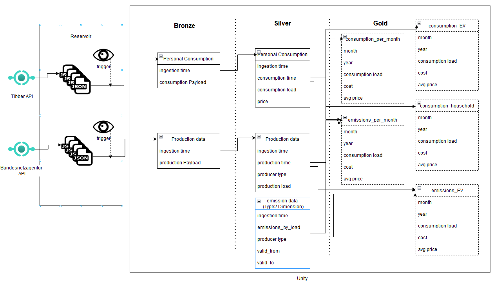

# energy_emission_tracker
This project involves ingesting country-wide electricity production and personal consumption data to calculate the emissions related to household electricity use.

# Tooling
The software is supposed to be run on databricks using data from the German National Grid Agency and Tibber.

# Conceptual Data Flow

There are three major concepts. Personal electricity use, electrical energy production and emission characteristics of 
the supply. Production and Consumption change constantly and need to be requested and processed real time. Emission 
characteristics for different types of power plants are somewhat stable, but those could change due to closure or 
opening of plants or technological adaptations. I will account for this by modelling it as a Slowly Changing Dimension 
Table ([Type 2](https://en.wikipedia.org/wiki/Slowly_changing_dimension#Type_2:_add_new_row))

The overview:

## Reservoir
This is cloud storage where the REST clients can offload the responses. We can set up a short retention period for cost
efficiency.

This location is monitored for changes, which initialize read streams using the `cloudfiles` feature of databricks.

## Unity
The following datasets are saved as Delta Tables within the unity catalog.
### Bronze
Bronze reflects efficient, append-only representations of the API responses.
### Silver
Silver unpacks the responses and selects the relevant subset of the payloads stored in bronze. Type matching is enforced
and convenience attributes like parsed dates (`year`, `month`, `day`) are added. The emissions table is created and 
updated manually as needed.
### Gold
The Silver data is integrated, separated and/or aggregated into _Views_ here.
- Aggregations:
  - consumption or production per month, year
- Separations:
  - EV consumption: The EV always charges with 11kw. While the consumption is `>11kw`, then `11kw` load is calculated as EV
  - household consumption: Based on the assumption that this never surpasses 11kw, it is calculated as `overall_consumption modulo 11kw`
- Integration
  - join consumption and production in time frames to create a causal link from energy use to production
  - join production and emission info on producer type to link emission to production
  - both joins then link consumption to emissions by one of the following models
    - average emissions of production in the grid
    - merit order
    - worst emitter
    - locality, taking into account redispatch measures

One can add access, obfuscation or aggregation clauses to provide fine-grained access control to different consumers.

# Execution
- [Reset All Tables, Stream checkpoints and Files](pipelines/reset_all.py)
  - downstream notebooks can reset parts or just setup or tear down
- Execute all `request` notebooks to activate the API clients
- Execute all `ingest`, `silver` notebooks to activate the stream processors
- Execute all `gold` notebooks to declar the gold views